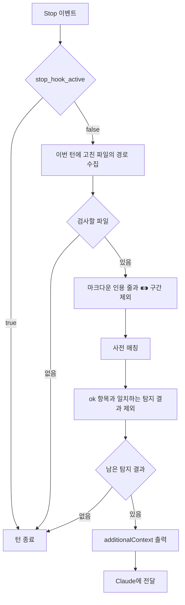

# anti-claudeism

anti-claudeism은 한국어 텍스트의 문체를 검사하는 Hook 하나와 Skill 하나로 이루어진다.

| 구성요소            | 종류      | 실행 시점                | 검사 방식                          |
| ------------------- | --------- | ------------------------ | ---------------------------------- |
| `anti_claudeism.py` | Stop Hook | 파일을 고친 턴이 끝날 때 | 사전에 등록된 정규식과 매칭        |
| `anti-claudeism`    | Skill     | 호출할 때                | Skill 본문에 적힌 판정 기준과 대조 |

낱말과 표기는 Hook이, 문형과 문장 구조는 Skill이 검사한다.

## Hook 동작



- Hook은 에이전트를 실행하지 않고 사전의 정규식으로만 탐지한다.
- Hook은 탐지 결과를 출력하기만 하고 파일을 고치지 않는다.
  - 지적된 표현을 고칠지는 Claude가 판단한다.

## 탐지 대상

- Hook은 이번 턴에 `Write`·`Edit`·`MultiEdit`·`NotebookEdit`으로 고친 파일을 처음부터 끝까지 검사한다.
- 고친 파일의 경로는 `transcript_path`가 가리키는 JSONL에서 찾는다.
  - 마지막 사용자 입력 뒤에 나온 `tool_use` 블록에서 경로를 모은다.
- 검사할 파일을 확장자로 고르지 않는다.
- 아래 파일은 검사하지 않는다.
  - 이름이 `claudeism-dictionary.json`이나 `test_anti_claudeism.py`인 파일
  - 크기가 1MB를 넘는 파일
    - 크기는 파일을 열기 전에 확인한다.
  - UTF-8과 CP949 중 어느 인코딩으로도 읽히지 않는 파일
    - UTF-8로 먼저 읽고, 실패하면 CP949로 다시 읽는다.
- 마크다운 파일(`.md`, `.mdx`, `.markdown`)에서는 인용 줄을 검사하지 않는다.
  - 줄 앞의 공백과 목록 표지(`-`, `*`, `+`, `1.`)를 건너뛰고 처음 나오는 글자가 `>`이면 인용 줄로 판정한다.
  - 검사에서 제외하는 범위는 `>`부터 줄 끝까지다.
    - `>`가 없는 줄은 인용 줄 바로 아래에 있어도 검사한다.
  - `> [!NOTE]`처럼 첫 줄이 `[!유형]`으로 시작하는 인용 블록(알림 블록)은 검사한다.
    - 인용 블록은 인용이 아닌 줄의 다음 줄이나, 목록 표지가 붙은 인용 줄에서 새로 시작한다.
- 마크다운 파일에서는 `⁌`와 `⁍`로 감싼 구간도 검사하지 않는다.
  - `⁌`와 `⁍`가 같은 줄에 있을 때만 제외한다.

## 신호

- 탐지 결과를 `hookSpecificOutput.additionalContext`에 넣어 stdout으로 출력한다.
  - stdout에는 UTF-8 바이트를 쓴다.
- 종료 코드는 탐지 여부와 무관하게 항상 0이다.
  - Hook은 종료 코드 2로 턴을 차단하지 않는다.
- `stop_hook_active`가 `true`이면 검사하지 않고 종료한다.
  - 따라서 Hook은 한 턴에 탐지 결과를 한 번만 출력한다.

### 문구

- 출력은 머리말 한 줄, 빈 줄, 탐지 결과 순서로 구성된다.
- 머리말에는 Claude에게 주는 지시가 두 가지 들어 있다.
  - 지적된 낱말만 바꾸지 말고 문장을 새로 쓴다.
  - 지적이 유효했다면 `anti-claudeism` Skill 본문을 다시 읽고, 이번 턴에 고친 파일을 모두 퇴고한다.
- 탐지 결과는 한 건에 한 줄씩 쓴다.
  - 같은 표현이 여러 곳에서 탐지되면 위치마다 따로 쓴다.

아래 예시에서는 머리말과 빈 줄을 생략했다.

```
docs/queue.md:12  "소비자"가 컴퓨터 용어에서 consumer의 직역으로 쓰였다면 "컨슈머"로 수정한다.
docs/queue.md:31  "재수출"이 re-export의 직역으로 쓰였다면 수정한다.
```

- 탐지 결과 한 줄의 형식은 `<path>:<line>  "<term>"이/가 <as>(으)로 쓰였다면 "<use>"로 수정한다.`이다.
  - `<path>`는 파일이 `CLAUDE_PROJECT_DIR` 안에 있으면 상대경로로, 밖에 있으면 절대경로로 쓴다.
  - `<term>` 자리에는 사전의 `term` 대신 실제로 탐지된 문자열이 들어간다.
  - `<as>` 자리에는 사전의 `as`가 따옴표 없이 들어간다.
  - 사전의 `use`가 비어 있으면 `"<use>"로`를 생략하고 `수정한다`로 끝낸다.
- 조사는 앞말의 마지막 글자에 따라 고른다.
  - `이/가`: 탐지된 문자열의 마지막 글자에 받침이 있으면 `이`, 없으면 `가`
  - `(으)로`: `as`나 `use`의 마지막 글자에 받침이 없거나 받침이 `ㄹ`이면 `로`, 그 밖에는 `으로`

## 사전

- Claude가 실제로 잘못 사용한 표현만 사전에 넣는다.

| 필드   | 내용                 |
| ------ | -------------------- |
| `term` | 매칭에 사용할 정규식 |
| `as`   | 피해야 할 용례       |
| `use`  | 대신 쓸 표현         |

- `term`에 정규식 특수문자가 없으면, 텍스트에서 그 문자열과 똑같은 곳이 모두 탐지된다.
- 컴파일되지 않는 `term`은 건너뛴다.
- `as`가 `ok`인 항목은 탐지 결과에서 제외할 표현을 정한다.
  - 탐지된 문자열 안에 `ok` 항목의 `term`과 일치하는 곳이 있으면, 그 결과를 제외한다.
- `use`가 비어 있으면 대체 표현 없이 지적만 한다.
  - 대체 표현이 문맥마다 달라지는 항목은 `use`를 비운다.

### 사전 파일

- Hook은 아래 사전 파일 세 개를 순서대로 읽어 합친다.
  - 같은 `term`이 여러 파일에 있으면 나중에 읽은 파일의 항목을 쓴다.

| 순서 | 파일                                                        | 범위                  |
| ---- | ----------------------------------------------------------- | --------------------- |
| 1    | Hook 스크립트와 같은 디렉터리의 `claudeism-dictionary.json` | Skill과 함께 설치된다 |
| 2    | `~/.claude/claudeism-dictionary.json`                       | 이 사용자의 모든 작업 |
| 3    | `${CLAUDE_PROJECT_DIR}/.claude/claudeism-dictionary.json`   | 이 프로젝트           |

- 2번이나 3번 파일이 없으면 오류 없이 건너뛴다.
- 프로젝트 루트는 `CLAUDE_PROJECT_DIR`이 가리키는 경로다.

## Skill

- Skill은 Hook의 정규식으로 탐지할 수 없는 문장 단위 결함을 다룬다.
  - Claude가 Skill 본문의 판정 기준과 예시에 따라 대상 텍스트를 읽고 결함을 찾는다.
  - Skill은 Opus 이상의 모델에서만 제대로 동작한다.
- 호출 이름은 `anti-claudeism`, `안티클로디즘`, `클로디즘`이다.
  - Claude는 이 이름으로 호출되었을 때만 Skill을 실행한다.
- 검사 대상은 호출할 때 지정한 범위다.
  - 범위를 지정하지 않으면 이번 작업에서 새로 쓰거나 고친 한국어 텍스트를 검사한다.

## 설치

- 설치는 `project-skills-bootstrap` 플러그인의 `bootstrap-anti-claudeism` Skill이 맡는다.
  - Skill 본문, Hook 스크립트, 사전을 `.agents/skills/anti-claudeism/`에 함께 설치한다.
  - 프로젝트의 `.claude/settings.json`에서 `hooks.Stop`에 Hook을 등록한다.
    - 명령: `python3 "${CLAUDE_PROJECT_DIR}/.agents/skills/anti-claudeism/anti_claudeism.py"`
    - 타임아웃: 10초
- `.claude/skills/anti-claudeism`은 `.agents/skills/anti-claudeism/`을 가리키는 심볼릭 링크다.
- Hook 스크립트는 `anti_claudeism.py` 한 파일이다.
  - `coding-standards`의 200줄 규칙은 Hook 스크립트에 적용하지 않는다.
