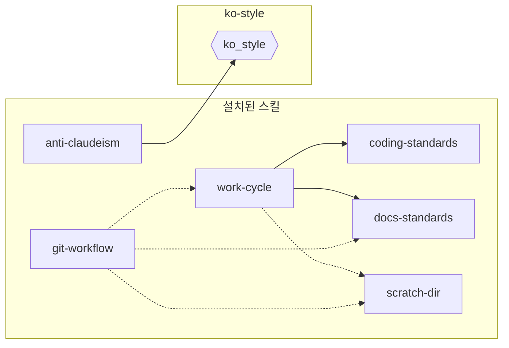

# 구성요소 의존 관계

화살표 `A → B`는 A가 B의 존재를 전제한다는 뜻이다. 화살표가 없으면 어느 쪽으로도
의존이 없다. 다이어그램에서 hook은 육각형으로, skill은 사각형으로 표현했다.

- 실선은 강결합이다. A 본문이 B의 이름을 직접 참조한다.
  - B의 이름을 변경하면 A의 참조가 끊어진다.
- 점선은 약결합이다. A 본문이 B를 참조하지 않는다. B는 자기 트리거 조건이 충족될 때 활성화된다.
  - `git-workflow`의 구현 단계는 파일 수정을 포함하므로 `work-cycle`의 발동 조건에 해당한다.
  - B의 이름을 변경해도 B에 대한 A의 참조는 유효하다.
- 설치된 스킬의 이름은 그것을 설치하는 부트스트랩 스킬의 이름에서 `bootstrap-` 접두사를 뺀 것이다.
  - `bootstrap-fluent-korean`이 설치하는 것은 스킬이 아니라 출력 스타일이며, 이 다이어그램에 대응하는 노드가 없다.
