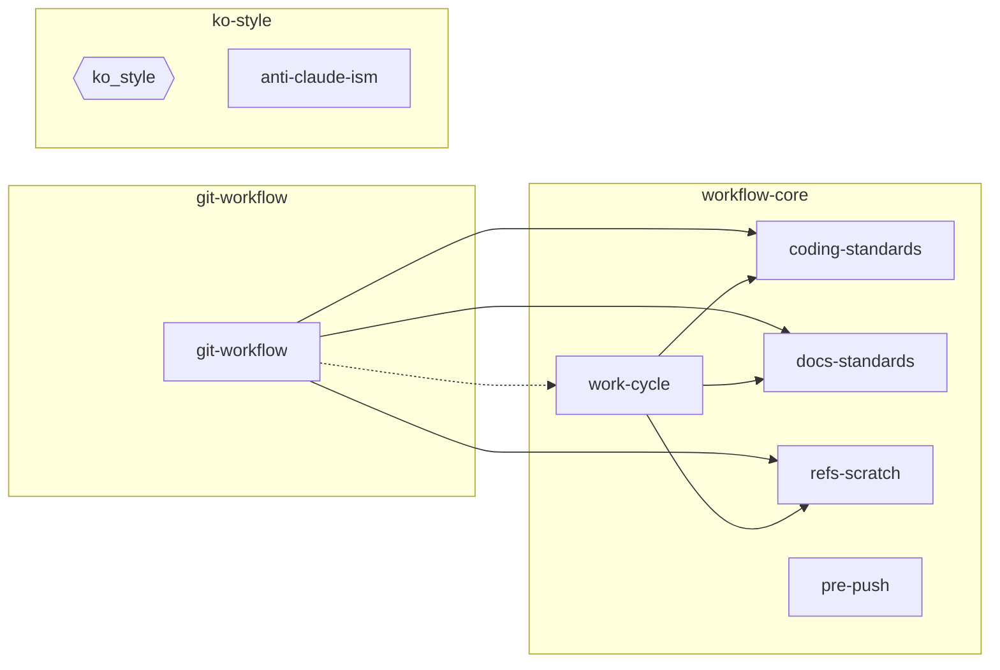

# 구성요소 의존 관계

이 킷이 담은 스킬과 훅이 서로를 어떻게 필요로 하는지.

화살표 `A → B`는 A가 동작 중 B를 필요로 한다는 뜻이다. 방향을 거슬러 올라가면 어느 하나를
고칠 때 누가 영향받는지가 보인다. 결합의 세기는 선 종류로, 구성요소의 종류는 노드 모양으로
구분한다.

- **실선은 강결합이다.** A가 본문에서 B의 스킬 이름을 직접 부른다. 이름이 바뀌면 참조가
  깨지므로 함께 고친다.
- **점선은 약결합이다.** A는 B의 이름을 부르지 않고, B가 자기 트리거로 발동해 붙는다.
  `git-workflow`의 구현 단계는 파일을 고치는 작업이므로 `work-cycle`이 스스로 뜬다. B를
  개명해도 A는 안 깨지지만, **설치돼 있어야 뜬다는 점에서 실제 의존은 그대로다.**
- **육각형은 훅이고 사각형은 스킬이다.** `ko_style`과 `anti-claude-ism`이 각각 무엇을 맡는지는
  [ko-style 설계](ko-style.md)에 있다.
- **화살표가 없는 노드는 어느 쪽으로도 의존이 없다.**
