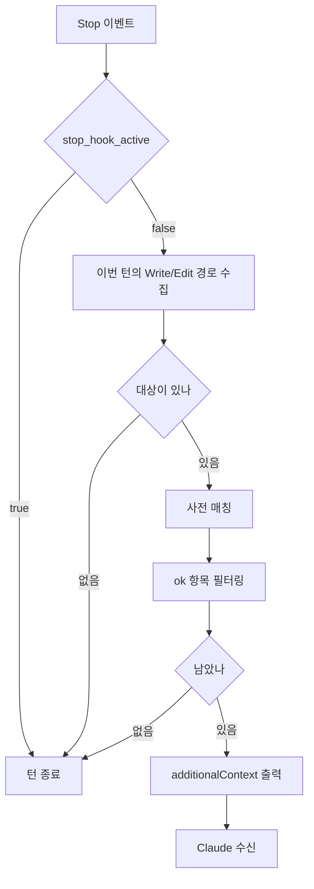

# ko-style

한국어 텍스트의 문체를 검사하는 플러그인이다.

| 구성요소          | 종류      | 실행 시점                | 판정 방식          |
| ----------------- | --------- | ------------------------ | ------------------ |
| `ko_style`        | Stop Hook | 파일을 고친 턴이 끝날 때 | 사전의 정규식 매칭 |
| `anti-claude-ism` | Skill     | 호출 시                  | 목록에 대조한 판정 |

낱말과 표기는 Hook이, 문형과 문장 구조는 Skill이 검사한다.

## Hook 동작



- 판정은 사전의 정규식 매칭이다. 에이전트를 띄우지 않는다.
- Hook은 탐지 결과를 출력하고, 수정 여부는 Claude에 위임한다.

## 판정 대상

- 이번 턴에 `Write`·`Edit`·`MultiEdit`·`NotebookEdit`으로 고친 파일 전체를 검사한다.
- 사용자가 끊은 턴의 편집은 판정하지 않고 다음 턴으로 넘기지도 않는다.
- 경로는 `transcript_path`의 JSONL에서 마지막 사용자 입력 이후의 `tool_use` 블록으로 수집한다.
- 확장자는 가리지 않는다. 파일명이 `ko-style-dictionary.json`인 파일과 텍스트로 읽히지 않는
  파일만 제외한다.
  - UTF-8로 읽고 안 되면 CP949로 다시 읽는다. 둘 다 실패하면 건너뛴다.
- 1MB를 넘는 파일은 읽지 않는다. 크기는 열기 전에 확인한다.

## 사전

- 실제로 틀렸던 표현만 등재한다.
- 항목은 세 필드다.

| 필드   | 내용                                               |
| ------ | -------------------------------------------------- |
| `term` | 매칭할 표현                                        |
| `as`   | 무엇으로 판정했는지. `ok`이면 그 항목을 끈다       |
| `use`  | 대신 쓸 표현. 비워 두면 대체 표현 없이 지적만 한다 |

- `as`는 그 자리에서 무엇을 확인해야 하는지를 나타낸다. 판정 이름이 곧 검사 방법이다.
  - `컴퓨터 용어에서 consumer의 직역`, `이중 피동`, `무생물 주어에 붙은 사람 동사`.
  - 등재한 표현이 쓰인 자리마다 참이 되는 판정은 실효성이 없다.
- 대체 표현이 문맥마다 달라지는 항목은 `use`를 비워 둔다.
- `term`은 정규식이다. 특수문자가 없으면 부분 문자열과 같게 동작한다.
  - `소비자`는 `소비자가`에도 매칭된다. `재수출`은 `재수출한다`에도 매칭된다.
- 다른 단어에 포함되는 표현은 경계 조건을 추가한다.
  - `(?<![가-힣])딛고`는 `딛고`에 매칭되고 `내딛고`는 제외한다.
- 체언은 뒤에 조사가 붙는다. 하나만 적으면 나머지가 붙은 자리를 놓치므로 열거한다.
  - `축[은이]`는 `축은`과 `축이`에 함께 매칭된다.
- 용언은 활용형이 계속 늘어난다. 직역인 활용형과 아닌 활용형 중 적은 쪽을 적는다.
  - 직역인 쪽이 적으면 그것을 열거한다. `되어[지진졌]`는 `되어지다`의 활용형에만 매칭되고
    `되어서`·`되어야`는 제외한다.
  - 아닌 쪽이 적으면 어간 뒤로 한 글자를 받고 그것만 뺀다.
    `(?<![가-힣])덮(?!어쓰)[가-힣]`는 `덮는`·`덮도록`·`덮은`에 매칭되고 `덮어쓰기`는 제외한다.
- 컴파일되지 않는 `term`은 건너뛴다.

### 사전 파일

셋을 순서대로 읽어 합친다. 같은 `term`이 겹치면 뒤에 읽은 것이 우선한다.

| 순서 | 파일                                                     | 범위                     |
| ---- | -------------------------------------------------------- | ------------------------ |
| 1    | `${CLAUDE_PLUGIN_ROOT}/hooks/ko-style-dictionary.json`   | 플러그인과 함께 배포된다 |
| 2    | `~/.claude/ko-style-dictionary.json`                     | 이 사용자의 모든 작업    |
| 3    | `${CLAUDE_PROJECT_DIR}/.claude/ko-style-dictionary.json` | 이 프로젝트              |

- 1번 외에는 없어도 그대로 넘어간다.
- 프로젝트 루트는 `CLAUDE_PROJECT_DIR` 환경변수로 지정한다.

`as`가 `ok`인 항목은 탐지에 쓰지 않고, 탐지 결과를 거르는 데 쓴다. 원문이 아니라 탐지된
문자열에 그 정규식을 적용해 일치하면 결과에서 뺀다.

- 끄려는 항목의 `term`을 그대로 옮겨 적지 않아도 된다. `(?<![가-힣])축이`의 탐지 결과는
  `축이`이므로 `축`만 적어도 걸러진다.
- 하나로 여럿을 끌 수 있다. `소비자`는 `소비자`와 `소비자가`를 함께 거른다.

## 신호

- 탐지 결과를 `hookSpecificOutput.additionalContext`에 넣어 stdout으로 출력한다. stdout에는
  UTF-8 바이트를 쓴다.
- 종료 코드는 탐지 여부와 무관하게 언제나 0이고, 2는 쓰지 않는다.
- `stop_hook_active`가 `true`이면 검사 없이 종료한다. 한 턴에 한 번만 출력한다.

### 문구

머리말 한 줄과 빈 줄이 앞에 오고, 그 뒤로 탐지 한 건이 한 줄씩 이어진다.

```
아래는 치환 지시가 아니라 판정 근거다. 왜 걸렸는지 읽고 그 자리에 맞는 한국어 문장으로 다시 쓴다.

docs/queue.md:12  "소비자"가 컴퓨터 용어에서 consumer의 직역으로 쓰였다면 "컨슈머"로 수정한다.
docs/queue.md:31  "재수출"이 re-export의 직역으로 쓰였다면 수정한다.
```

- 따옴표 안은 사전의 `term`이 아니라 실제로 탐지된 문자열이다.
- `as`는 따옴표 없이 그대로 넣는다.
- `use`가 비어 있으면 `"컨슈머"로`를 생략하고 `수정한다`로 끝낸다.
- 경로는 `CLAUDE_PROJECT_DIR` 기준 상대경로로 쓰고, 그 밖이면 절대경로를 그대로 쓴다.
- 같은 표현이 여러 곳에 있으면 위치마다 한 줄씩 쓴다.
- 조사는 탐지된 문자열의 마지막 글자로 고른다. 받침이 있으면 `이`, 없으면 `가`다.
- `as`와 `use` 뒤의 조사도 그 마지막 글자로 고른다. 받침이 없거나 `ㄹ`이면 `로`, 그 밖에는
  `으로`다.

## Skill

`anti-claude-ism`은 대상 텍스트에서 Claude 문체의 낱말과 문장을 찾아 문맥에 맞는 한국어로
다시 쓰는 skill이다.

- 호출 이름은 `anti-claude-ism`, `안티클로디즘`, `클로디즘`이다. Claude가 자동으로 호출하거나
  사용자가 `/ko-style:anti-claude-ism`으로 호출한다.
- 대상은 지정받은 범위이고, 지정이 없으면 이번 작업에서 새로 쓰거나 고친 한국어 텍스트다.
  문서, 주석, 독스트링, 커밋 메시지, 이슈와 PR/MR 설명을 포함한다.
- 판정 근거는 목록 파일 둘이다. 낱말 단위는 `references/word-level.md`, 문장 단위는
  `references/sentence-level.md`다. 판정과 파일의 대응은 `SKILL.md`에 정리돼 있다.
- `SKILL.md`에는 대상·절차·판정 기준만 적고 예시는 목록 파일에 둔다.
- 목록에는 실제로 틀렸던 예시를 원문 그대로 등재하고, 고친 문장은 남기지 않는다.
- 판정 이름은 목록의 절 제목이다. 무엇이 잘못됐는지를 절 머리에 적고, 그 아래에 근거가 되는
  예시를 열거한다.

## 배포

- `workflow-core`와 별개인 `ko-style` 플러그인으로 배포한다. 상호 의존은 없다.
- `.claude-plugin/plugin.json`을 두고 마켓플레이스 카탈로그에 등록한다.
- skill 파일은 `skills/anti-claude-ism/`에, 목록 파일은 그 아래 `references/`에 있다.
- `hooks/hooks.json`에서 `Stop` 이벤트에 스크립트를 등록한다. matcher는 없고, `timeout`은
  10초, 스피너 문구는 `한국어 문체 검수 중`이다.
- 스크립트는 Python으로 작성하고 `python3 "${CLAUDE_PLUGIN_ROOT}/hooks/ko_style.py"`로
  실행한다.
- 스크립트는 파일 하나다. 길이와 무관하게 나누지 않는다.
