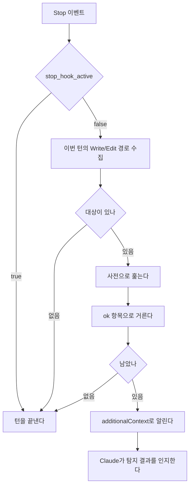

# 번역투 탐지 훅

`ko-style`은 한국어 문서에 영문 직역체가 들어가면 턴이 끝나기 전에 알리는 Stop 훅이다.

낱말과 표기는 이 훅이 맡고, 문장이 성립하는지는 `workflow-core:docs-standards`의 리뷰 기준이
맡는다.

## 동작



- 판정은 사전의 정규식 매칭이다. 에이전트를 띄우지 않는다.
- 훅은 탐지 결과를 알리고, 고칠지 말지는 Claude가 정한다.

## 판정 대상

- 이번 턴에 `Write`·`Edit`·`MultiEdit`·`NotebookEdit`으로 고친 파일이다. 파일 전체를 훑는다.
- 사용자가 끊은 턴의 편집은 판정하지 않고 다음 턴으로 넘기지도 않는다.
- 경로는 `transcript_path`의 JSONL에서 마지막 사용자 입력 이후의 `tool_use` 블록으로 모은다.
- 확장자는 가리지 않는다. 사전 파일 셋과 텍스트로 읽히지 않는 파일만 뺀다.
  - UTF-8로 읽고 안 되면 CP949로 다시 읽는다. 둘 다 실패하면 건너뛴다.
- 1MB를 넘는 파일은 읽지 않는다. 크기는 열기 전에 본다.

## 사전

- 실제로 틀렸던 표현만 등재한다.
- 항목은 세 필드로 이루어진다.

| 필드   | 내용                                               |
| ------ | -------------------------------------------------- |
| `term` | 매칭할 표현                                        |
| `as`   | 무엇으로 판정했는지. `ok`이면 그 항목을 끈다       |
| `use`  | 대신 쓸 표현. 비워 두면 대체 표현 없이 지적만 한다 |

- `as`에는 직역의 원어와 정서법의 이름이 함께 들어간다 — `컴퓨터 용어에서 consumer의 직역`,
  `이중 피동`.
- 대체 표현이 문맥마다 갈리는 항목은 `use`를 비워 둔다.
- `term`은 정규식이다. 특수문자가 없으면 부분 문자열과 같게 동작한다.
  - `소비자`가 `소비자가`를, `되어지`가 `되어졌다`를 잡는다.
- 다른 단어에 파묻히는 표현은 경계를 건다.
  - `(?<![가-힣])축이`는 `축이라는`과 `축이었다`를 잡고 `건축이`와 `압축이`는 거른다.
- 컴파일되지 않는 `term`은 건너뛴다.

### 사전 파일

셋을 순서대로 읽어 합친다. 같은 `term`이 겹치면 뒤에 읽은 것이 이긴다.

| 순서 | 파일                                                     | 범위                     |
| ---- | -------------------------------------------------------- | ------------------------ |
| 1    | `${CLAUDE_PLUGIN_ROOT}/hooks/dictionary.json`            | 플러그인과 함께 배포된다 |
| 2    | `~/.claude/ko-style-dictionary.json`                     | 이 사용자의 모든 작업    |
| 3    | `${CLAUDE_PROJECT_DIR}/.claude/ko-style-dictionary.json` | 이 프로젝트              |

- 1번 외에는 없어도 그대로 넘어간다.
- 프로젝트 루트는 `CLAUDE_PROJECT_DIR` 환경변수로 잡는다.

`as`가 `ok`인 항목은 탐지에 쓰지 않고, 탐지 결과를 거르는 데 쓴다. 원문이 아니라 탐지된
문자열에 그 정규식을 돌려 걸리면 결과에서 뺀다.

- 끄려는 항목의 `term`을 그대로 옮겨 적지 않아도 된다. `(?<![가-힣])축이`가 잡아낸 결과는
  `축이`이므로 `축`만 적어도 걸러진다.
- 하나로 여럿을 끌 수 있다. `소비자`는 `소비자`와 `소비자가`를 함께 거른다.

## 신호

- stdout에 `hookSpecificOutput.additionalContext`를 실어 알린다.
- 종료 코드는 탐지 여부와 무관하게 언제나 0이고, 2는 쓰지 않는다.
- `stop_hook_active`가 `true`인 Stop은 아무것도 하지 않고 통과시킨다. 한 턴에 한 번만
  알린다.

### 문구

탐지 한 건이 한 줄이다.

```
docs/queue.md:12  "소비자"가 컴퓨터 용어에서 consumer의 직역으로 쓰였다면 "컨슈머"로 수정한다.
docs/queue.md:31  "재수출"이 re-export의 직역으로 쓰였다면 수정한다.
```

- 따옴표 안은 사전의 `term`이 아니라 실제로 탐지된 문자열이다.
- `as`는 따옴표 없이 그대로 넣는다.
- `use`가 비어 있으면 `"컨슈머"로`에 해당하는 자리를 통째로 빼고 `수정한다`로 끝낸다.
- 경로는 `CLAUDE_PROJECT_DIR` 기준 상대경로로 쓰고, 그 밖이면 절대경로를 그대로 쓴다.
- 같은 표현이 여러 곳에 있으면 위치마다 한 줄씩 쓴다.
- 조사는 탐지된 문자열의 마지막 글자로 고른다. 받침이 있으면 `이`, 없으면 `가`다.

## 배포

- `workflow-core`와 별개인 `ko-style` 플러그인으로 배포한다. 어느 쪽도 상대에 의존하지
  않는다.
- `.claude-plugin/plugin.json`을 두고 마켓플레이스 카탈로그에 등록한다.
- `hooks/hooks.json`이 `Stop`에 스크립트를 건다. matcher는 없다.
- 스크립트는 Python으로 쓰고 `python3 "${CLAUDE_PLUGIN_ROOT}/hooks/ko_style.py"`로 부른다.
- 스크립트는 파일 하나다. 길이와 무관하게 나누지 않는다.
