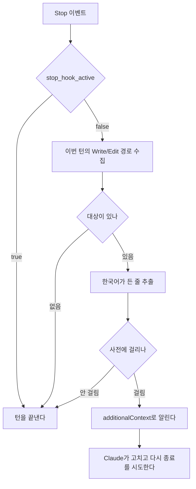

# 번역투 탐지 훅

`ko-style`은 한국어 문서에 영문 직역체가 들어가면 Claude Code의 턴을 종료하지 못하게 하고,
걸린 어휘를 알리는 Stop 훅이다.

어휘는 이 훅이 맡고, 문장이 성립하는지는 `workflow-core:docs-standards`의 리뷰 기준이 맡는다.

## 동작

- 판정은 사전의 키워드 매칭이다. 에이전트를 띄우지 않는다.
- 훅은 걸린 어휘와 대체 표현을 알릴 뿐 적용 여부는 정하지 않는다. `소비자`가 큐 맥락이면
  컨슈머로 고치고 경제 맥락이면 그대로 두는 판단은 문맥을 읽는 쪽이 한다.

## 판정 대상

이번 턴에 `Write`·`Edit`·`MultiEdit`·`NotebookEdit`으로 고친 파일 중 한국어가 든 줄이다.
경로는 `transcript_path`의 JSONL에서 마지막 사용자 입력 이후의 `tool_use` 블록으로 모은다.

## 사전

실제로 틀렸던 어휘만 등재한다. 항목은 세 필드로 이루어지고, 스키마의 SoT는 사전 파일이다.

| 필드   | 내용                  |
| ------ | --------------------- |
| `term` | 매칭할 어휘           |
| `as`   | 이 어휘가 직역인 원어 |
| `use`  | 대신 쓸 표현          |

훅이 내보내는 문구는 `term`이 `as`의 뜻으로 쓰였을 때만 `use`로 바꾸라는 형태다.

## 신호

stdout에 `hookSpecificOutput.additionalContext`를 실어 알린다. 종료 코드는 걸렸든 아니든
언제나 0이고, 2는 쓰지 않는다.

루프 보호는 입력의 `stop_hook_active`와 8회 연속 상한이다.

## 훅이 돌지 않는 경우

- 사용자 인터럽트로 끝난 턴
- API 에러로 끝난 턴. 이때는 `StopFailure`가 대신 발동하며 출력과 exit code가 무시된다

## 배포

`workflow-core`와 별개인 `ko-style` 플러그인으로 배포하고, `hooks/hooks.json`이 `Stop`에
스크립트를 건다. 스크립트는 Node로 쓰고 `node "${CLAUDE_PLUGIN_ROOT}/hooks/ko-style.mjs"`로
부른다.
