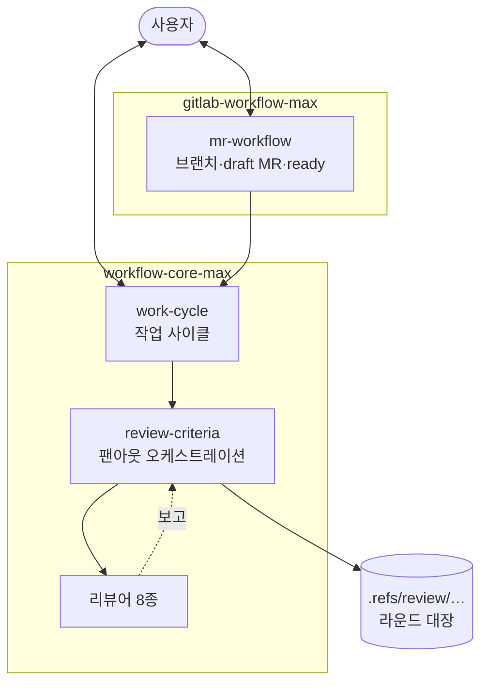

# `-max` 플러그인 설계

리포지토리에 변경을 만드는 작업을 작성-리뷰 사이클로 완주시키는 계열. 사이클의 리뷰
단계는 전문 서브 에이전트에 병렬로 흩뿌리고 메인이 검증해 확정한다. 커버리지를 위해
토큰을 아끼지 않는다.

`workflow-core`와 **독립**이며 둘을 같이 켜지 않는다. `github-workflow`·`gitlab-workflow`도
함께 끈다 ([0003](../decisions/0003-max-plugin-composition.md)). 스킬과 에이전트 본문은
한국어다 ([0001](../decisions/0001-max-plugins-in-korean.md)).



## 플러그인 경계

```
plugins/
  workflow-core-max/
    skills/
      work-cycle/         작업 사이클
      review-criteria/    팬아웃 오케스트레이션
      refs-scratch/       .refs/ 규약
    agents/               리뷰어 8종
  gitlab-workflow-max/
    skills/
      mr-workflow/        브랜치·draft MR·ready 전환
```

`gitlab-workflow-max`는 `workflow-core-max`에 의존한다. 전달 단계만 담고 설계·구현·리뷰는
`work-cycle`에 넘긴다.

`workflow-core`의 `docs-standards`는 스킬로 남지 않고 `docs-intent-auditor`·
`structure-auditor`로 분해돼 들어갔고, `pre-push`는 싣지 않는다. 그래서 문서를 **쓸 때**
쓰는 기능은 이 계열에 없다.

스킬 사이 참조는 [skill-references.md](skill-references.md), 구성을 이렇게 고른 근거는
[0003](../decisions/0003-max-plugin-composition.md).

## 작업 사이클

git 리포지토리에 변경을 만드는 모든 작업이 대상이다. "CLAUDE.md 개정"처럼 가벼운 단위도
워킹 트리 안에서 사이클을 완주한 뒤 완성본으로 올라간다.

| 단계          | 하는 일                                           | 사용자와 |
| ------------- | ------------------------------------------------- | -------- |
| 1 작업 단위   | 무엇을 바꾸는 작업이고 어떤 도메인인지 합의       | 대화     |
| 2 설계        | 규모에 따라 spec doc 또는 한 문단짜리 의도 진술   | 대화     |
| 3 구현        | 메인이 직접 한다. 서브 에이전트에 나누지 않는다   | 없음     |
| 4 리뷰 라운드 | `review-criteria`를 불러 빈 라운드 3연속까지 반복 | 없음     |
| 5 제시        | 완주한 결과물을 올린다                            | 대화     |

1단계의 도메인 판정이 4단계의 조건부 리뷰어 투입을 결정한다. 판정은 메인이 하고 결과를
1단계에서 알린다.

**4단계는 라운드마다 보고하지 않는다.** 메인이 지적을 받고, 고치고, 다시 돌린다. 사용자를
부르는 것은 메인이 혼자 정할 수 없을 때뿐이다 — 설계를 바꾸거나 작업 범위를 넓혀야 풀리는
지적, 그리고 같은 지적이 반복되거나 한 자리를 고칠 때마다 새 회귀가 나는 경우. 라운드
자체에 상한은 없다.

`work-cycle`은 `review-criteria`를 이름으로 부르고 팬아웃 표는 모른다. 사이클을 돌지 않는
순수 리뷰 요청은 `work-cycle` 없이 `review-criteria`만으로 돈다.

## 리뷰 팬아웃

### 대상

호스팅된 PR/MR, 브랜치, 커밋 전 워킹 디렉터리의 변경분. 마지막 것이 자기리뷰이고,
`work-cycle` 4단계가 도는 것이 이것이다. **수집은 메인이 한 번만 한다.** 절차는
`review-criteria` 스킬에 있다.

### 조율

에이전트끼리는 대화하지 않는다. 메인이 축마다 하나씩 띄우고 혼자 취합한다
([0002](../decisions/0002-parallel-review-fanout.md)).

취합의 절반은 **검증**이다. 메인은 인용된 `file:line`을 직접 열어 확인하고, 반증을 시도해
살아남은 것만 대장에 올린다.

### 기준의 위치

메인은 에이전트의 `description`과 자기가 넘긴 프롬프트만 본다. 정의 본문은 에이전트의
시스템 프롬프트로 들어갈 뿐 메인에게 보이지 않는다. 그래서 **"무엇을"은 스킬, "어떻게"는
에이전트**로 가른다.

| 위치                          | 담는 것                                                           |
| ----------------------------- | ----------------------------------------------------------------- |
| `review-criteria`의 팬아웃 표 | 각 에이전트의 책임 범위 — 무엇을 보고, 무엇을 **안 보는지**       |
| 에이전트 `description`        | 같은 범위를 한 문장으로. 메인에게 목록으로 주입되는 이중 안전장치 |
| 에이전트 본문                 | 그 범위 안에서 어떻게 깊게 파는지 — 기법, 체크리스트, 출력 포맷   |

에이전트는 자신이 실제로 적용한 범위를 보고와 함께 반환한다.

### 리뷰어

| 에이전트                    | 축                          |
| --------------------------- | --------------------------- |
| `correctness-hunter`        | 잠재 정확성 버그            |
| `resource-auditor`          | 누수와 낭비                 |
| `silent-failure-hunter`     | 문제를 숨기는 억제          |
| `test-auditor`              | 지키지 못하는 테스트        |
| `hygiene-auditor`           | 작업 흔적과 주변 관례 이탈  |
| `docs-intent-auditor`       | 문서와 설명의 규율          |
| `structure-auditor`         | 변경이 그은 참조 선         |
| `client-resilience-auditor` | 외부 호출의 복원력 (조건부) |

위는 축 이름뿐이다. 각 에이전트가 무엇을 보고 무엇을 안 보는지는 `review-criteria` 스킬의
팬아웃 표에 있고, 거기서 "안 본다"가 "본다"만큼의 자리를 차지한다.

### 라운드 채널

`.refs/` 아래 파일로 한다.

```
.refs/review/<작업-슬러그>/
  r1/, r2/, …      라운드마다 하나씩
    <agent>.md     각 에이전트가 낸 원본 보고
    verdict.md     메인이 검증을 마치고 확정한 라운드 결과
  ledger.md        라운드를 넘어 지속되는 지적 대장 (미해결/수정함/보류/기각)
```

**파일은 메인이 쓴다.** 에이전트는 읽기 전용이라 소스를 건드릴 수 없다. 지적마다
`r2-3`(라운드-순번) 형태의 번호를 붙이고, `ledger.md`가 그 번호와 상태를 이어받아 라운드를
넘어 누적된다.

`verdict.md`는 **리뷰를 단독으로 요청했을 때** 사용자와 대화하는 채널이다. 항목마다 결론이
날 때 상태와 한 줄 근거가 그 자리에 적힌다. `work-cycle` 안에서 돌 때는 메인이 스스로 읽고
처리하므로 기록으로만 남는다.

채널 형태를 파일로 정한 근거와 기각한 대안은
[0002](../decisions/0002-parallel-review-fanout.md)에 있다.

## 확장 후보

리뷰 축을 넓히는 후보는 [#3](https://github.com/nil-park/claude-workflow-kit/issues/3)에
모아 두었다.
