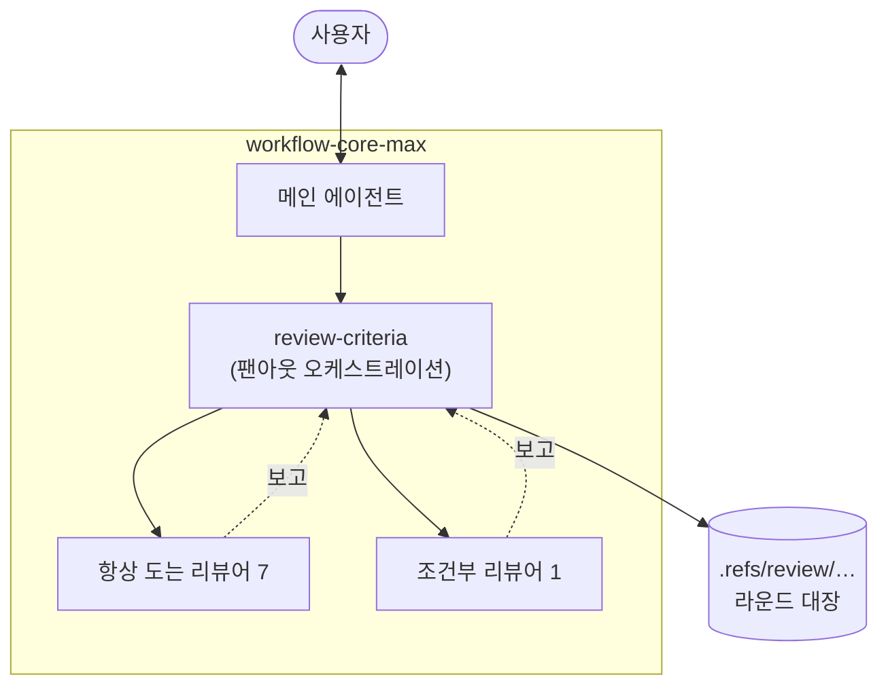

# `-max` 플러그인 설계

리뷰를 전문 서브 에이전트에 병렬로 흩뿌리고, 메인이 그 결과를 검증해 확정하는 계열.
커버리지를 위해 토큰을 아끼지 않는다.

`workflow-core`와 **독립**이며 둘을 같이 켜지 않는다. `github-workflow`·`gitlab-workflow`도
함께 끈다 ([0003](../decisions/0003-max-plugin-composition.md)). 스킬과 에이전트 본문은
한국어다 ([0001](../decisions/0001-max-plugins-in-korean.md)).



## 단계

1단계는 기존 `workflow-core:review-criteria`와 동등한 역할까지다. 판정 기준을 늘리지
않는다. 산출물은 `workflow-core-max` 플러그인 하나이고, 그 뒤는 [확장 후보](#확장-후보).

## 플러그인 경계

```
plugins/workflow-core-max/
  .claude-plugin/plugin.json
  skills/
    review-criteria/    팬아웃 오케스트레이션
    refs-scratch/       .refs/ 규약
  agents/               리뷰어 8종
```

`workflow-core`의 `docs-standards`는 스킬로 남지 않고 `docs-intent-auditor`·
`structure-auditor`로 분해돼 들어갔고, `pre-push`는 싣지 않는다. 그래서 문서를 **쓸 때**
쓰는 기능은 이 계열에 없다.

스킬 사이 참조는 [skill-references.md](skill-references.md), 구성을 이렇게 고른 근거는
[0003](../decisions/0003-max-plugin-composition.md).

## 리뷰 팬아웃

### 대상

기존 `review-criteria`와 같다 — 호스팅된 PR/MR, 브랜치, 커밋 전 워킹 디렉터리의 변경분.
마지막 것이 자기리뷰다. **수집은 메인이 한 번만 한다.** 절차는 `review-criteria` 스킬에
있다.

### 조율

에이전트끼리는 대화하지 않는다. 메인이 축마다 하나씩 띄우고 혼자 취합한다
([0002](../decisions/0002-parallel-review-fanout.md)).

취합의 절반은 **검증**이다. 메인은 인용된 `file:line`을 직접 열어 확인하고, 반증을 시도해
살아남은 것만 대장에 올린다.

### 기준의 위치

메인은 에이전트의 `description`과 자기가 넘긴 프롬프트만 본다. 정의 본문은 에이전트의
시스템 프롬프트로 들어갈 뿐 메인에게 보이지 않는다. 그래서 **"무엇을"은 스킬, "어떻게"는
에이전트**로 가른다.

| 위치                          | 담는 것                                                           |
| ----------------------------- | ----------------------------------------------------------------- |
| `review-criteria`의 팬아웃 표 | 각 에이전트의 책임 범위 — 무엇을 보고, 무엇을 **안 보는지**       |
| 에이전트 `description`        | 같은 범위를 한 문장으로. 메인에게 목록으로 주입되는 이중 안전장치 |
| 에이전트 본문                 | 그 범위 안에서 어떻게 깊게 파는지 — 기법, 체크리스트, 출력 포맷   |

에이전트는 자신이 실제로 적용한 범위를 보고와 함께 반환한다.

### 리뷰어 (1단계)

기존 `review-criteria`의 판정 항목을 그대로 여덟으로 분해한 것이다. 새 기준을 더하지
않는다.

| 에이전트                    | 축                          |
| --------------------------- | --------------------------- |
| `correctness-hunter`        | 잠재 정확성 버그            |
| `resource-auditor`          | 누수와 낭비                 |
| `silent-failure-hunter`     | 문제를 숨기는 억제          |
| `test-auditor`              | 지키지 못하는 테스트        |
| `hygiene-auditor`           | 작업 흔적과 주변 관례 이탈  |
| `docs-intent-auditor`       | 말과 코드의 어긋남          |
| `structure-auditor`         | 변경이 그은 참조 선         |
| `client-resilience-auditor` | 외부 호출의 복원력 (조건부) |

위는 축 이름뿐이다. 각 에이전트가 무엇을 보고 무엇을 안 보는지는 `review-criteria` 스킬의
팬아웃 표에 있고, 거기서 "안 본다"가 "본다"만큼의 자리를 차지한다.

### 라운드 채널

`.refs/` 아래 파일로 한다.

```
.refs/review/<작업-슬러그>/
  r1/, r2/, …      라운드마다 하나씩
    <agent>.md     각 에이전트가 낸 원본 보고
    verdict.md     메인이 검증을 마치고 확정한 라운드 결과
  ledger.md        라운드를 넘어 지속되는 지적 대장 (미해결/수정함/보류/기각)
```

**파일은 메인이 쓴다.** 에이전트는 읽기 전용이라 소스를 건드릴 수 없다.

`verdict.md`가 사용자와의 소통 채널이다. 지적마다 `r2-3` 같은 번호를 붙이고, 대화는 그
번호로 한다. 한 항목의 결론이 나면 다음 항목으로 넘어가기 전에 그 자리에 상태와 한 줄
근거를 적는다. `ledger.md`는 같은 번호를 그대로 이어받아 라운드를 넘긴다.

채널 형태를 파일로 정한 근거와 기각한 대안은
[0002](../decisions/0002-parallel-review-fanout.md)에 있다.

## 확장 후보

1단계를 실제로 써본 뒤에 손댈 목록은 이슈로 옮겼다.

- 리뷰어 확장 후보: [#3](https://github.com/nil-park/claude-workflow-kit/issues/3)
- 작업 사이클 일반화와 `gitlab-workflow-max`: [#4](https://github.com/nil-park/claude-workflow-kit/issues/4)
