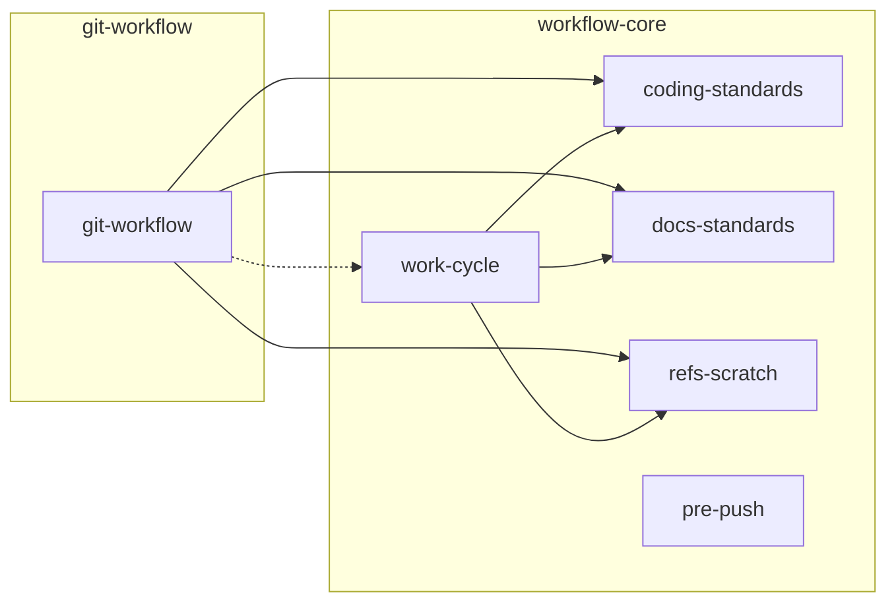

# 스킬 의존 관계

화살표 `A → B`는 A가 동작 중 B를 필요로 한다는 뜻이다. 방향을 거슬러 올라가면 이 스킬을
고칠 때 누가 영향받는지가 보인다. 결합의 세기를 선 종류로 구분한다.

- **실선은 강결합이다.** A가 본문에서 B의 스킬 이름을 직접 부른다. 이름이 바뀌면 참조가
  깨지므로 함께 고친다.
- **점선은 약결합이다.** A는 B의 이름을 부르지 않고, B가 자기 트리거로 발동해 붙는다.
  `git-workflow`의 구현 단계는 파일을 고치는 작업이므로 `work-cycle`이 스스로 뜬다. B를
  개명해도 A는 안 깨지지만, **설치돼 있어야 뜬다는 점에서 실제 의존은 그대로다.**
