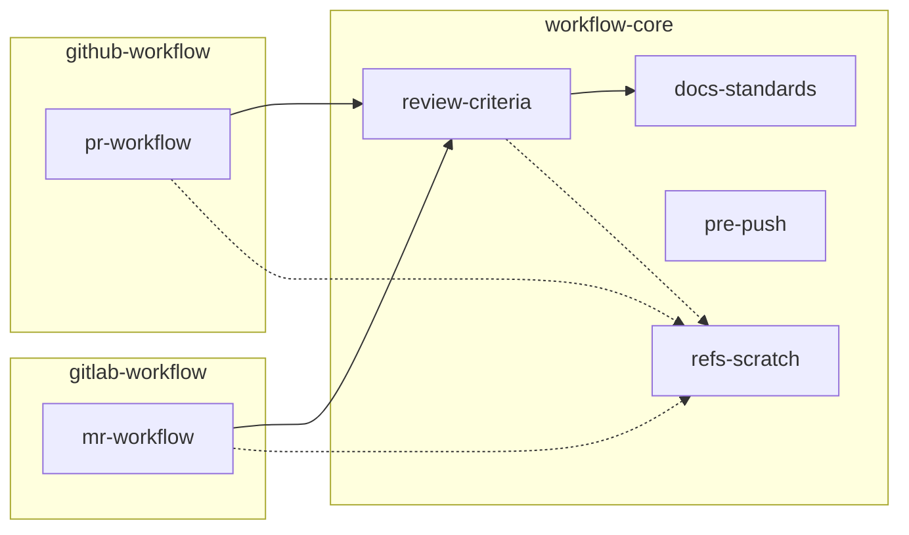
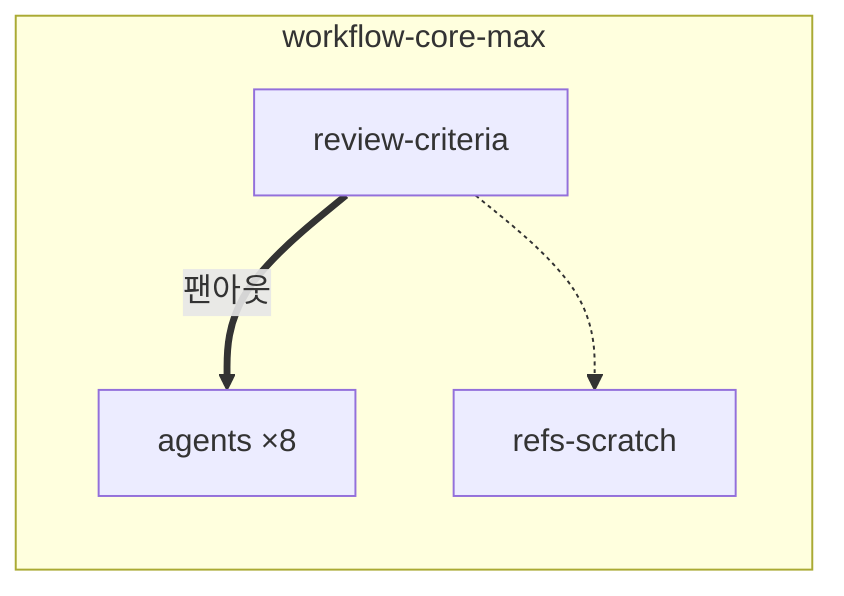

# 스킬 참조 관계

화살표 `A → B`는 **A가 동작 중 B를 필요로 한다**는 뜻이다. 방향을 거슬러 올라가면 "이 스킬을
고치면 누가 영향받나"가 보인다. 결합의 세기를 선 종류로 구분한다.

- **실선 = 강결합 (명시 참조).** A가 B의 **스킬 이름을 직접 부른다**. 이름이 바뀌면 참조가
  깨지므로 함께 고쳐야 한다.
  - `pr-workflow`·`mr-workflow` → `review-criteria`: 자기리뷰가 표준 리뷰 기준을 확실히
    적용하도록 명시로 묶은 품질 게이트.
  - `review-criteria` → `docs-standards`: 문서·주석 판정 기준을 명시로 가리킴.
- **점선 = 약결합 (암묵/트리거).** A는 B의 **이름을 부르지 않는다**. B가 상황 트리거로 스스로
  발동해 붙는다. B를 개명·이동해도 A는 안 깨진다.
  - `…` → `refs-scratch`: 참조하는 쪽은 "본문/리뷰를 **파일로 남겨라**"(WHAT)만 말하고,
    `.refs/` 위치·이름·gitignore(WHERE/HOW)는 `refs-scratch`가 "멀티라인 CLI body / 리뷰·
    아티팩트 저장" 트리거로 자동 발동해 채운다.

노드 성격:

- **`refs-scratch`·`docs-standards`** 는 나가는 참조가 없는 말단이다 — 각각 `.refs/` 규약과
  문서/주석 기준의 단일 출처.
- **`pre-push`** 는 참조가 없는 독립 스킬이다.
- 전체가 **비순환(DAG)** 이다(`docs-standards`의 "세 개 이상이 링을 닫으면 안 된다" 원칙과 부합).

## 플러그인 경계와의 관계

`pr-workflow`(github-workflow)·`mr-workflow`(gitlab-workflow)는 `workflow-core`의
`review-criteria`(강결합)와 `refs-scratch`(약결합)를 함께 쓴다. **약결합이어도 실제 의존은
그대로다** — `refs-scratch`가 트리거로 뜨려면 설치돼 있어야 하므로, 결합을 점선으로 낮춰도 각
`plugin.json`의 `dependencies: ["workflow-core"]`는 유지된다.

## `-max` 계열

`workflow-core-max`는 위 그래프와 **같이 켜지지 않는** 별도 계열이다
([설계](max-plugins.md)). 스킬이 스킬을 부르는 대신, 스킬 하나가 에이전트 여덟을 띄운다.

- **굵은 화살표 = 팬아웃.** 이름을 직접 부르는 강결합이라는 점은 실선과 같고, 하나가 여럿을
  병렬로 띄운 뒤 결과를 검증해 확정한다는 점만 다르다.
- **점선은 위와 같다.** `.refs/` 위치·이름 규약은 `refs-scratch`가 트리거로 발동해 채운다.

`docs-standards`에 해당하는 노드가 없다. 그 내용은 `docs-intent-auditor`와
`structure-auditor`로 분해돼 들어갔고, 그래서 이 계열에는 `review-criteria` →
`docs-standards` 강결합이 없다.
