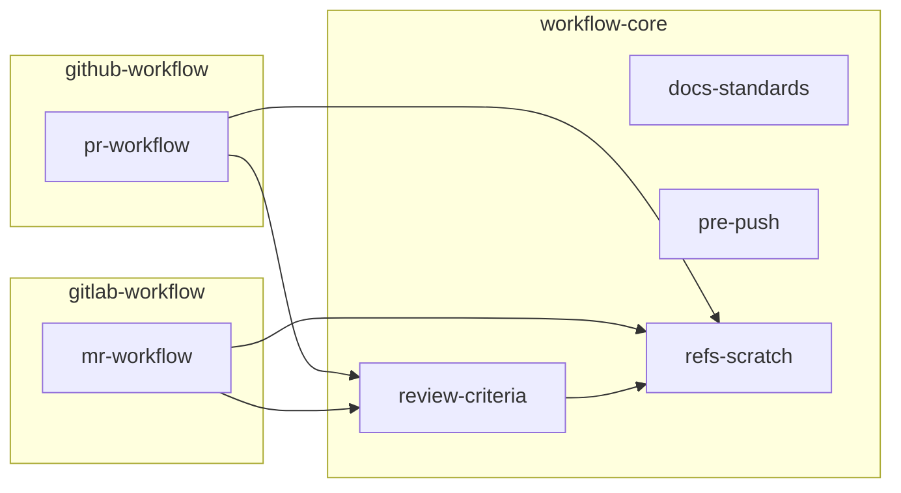

# 스킬 참조 관계

화살표 `A --> B`는 **A가 동작 중 B의 규약·지시를 따른다**(A가 B를 참조)는 뜻이다. 방향이 곧
의존 방향이라, 화살표를 거슬러 올라가면 "이 스킬을 고치면 누가 영향받나"가 보인다.

- **`refs-scratch`** 는 모두가 가리키는 말단이다 — `.refs/` 규약의 단일 출처.
- **`review-criteria`** 는 `pr-workflow`·`mr-workflow`가 자기리뷰 단계에서 참조하고, 자신은
  `refs-scratch`를 참조한다.
- **`docs-standards`·`pre-push`** 는 참조가 없는 독립 스킬이다.
- 전체가 **비순환(DAG)** 이다 — 어떤 셋도 링을 이루지 않는다(`docs-standards`의 "세 개 이상이
  링을 닫으면 안 된다" 원칙과 부합).

## 플러그인 경계와의 관계

`pr-workflow`(github-workflow)·`mr-workflow`(gitlab-workflow)가 `workflow-core`의
`review-criteria`·`refs-scratch`를 가리키므로, 두 플랫폼 플러그인은 `workflow-core`에 의존한다.
이 참조가 각 `plugin.json`의 `dependencies: ["workflow-core"]` 선언의 근거다.
